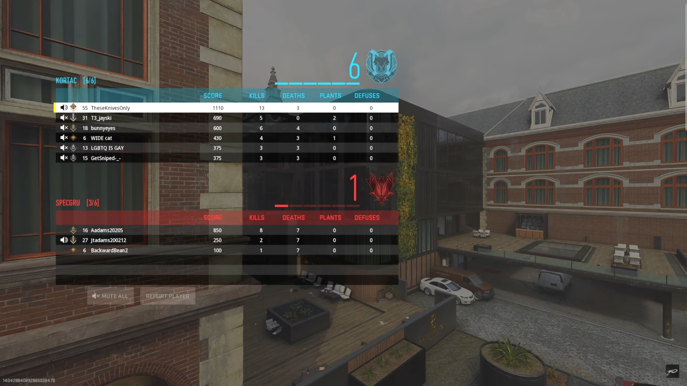

# Call of Duty Stat Tracker

### What is the problem that this project aims to solve?
The new Call of Duty game doesn't have a stats page<br>
Every game they have released for the past decade has included one. As someone who is obsessed with stats, this wasn't going to work for me, leaving me with one option.<br>
Make my own

### Step 1: Collecting Data

Unfortunately after searching online, there isn't even an API to pull data from like some past games have had. The only source for the data that I need is going to be the brief scoreboard that shows up at the end of each match. Below is an example that I will use to test the program as we go along



I decided that using optical character recognition would be the best route to get our stats from the scoreboard. After testing a few libraries I landed on EasyOCR as the best option to use.<br>
First we need to use the PyAutoGUI library to capture a screenshot of the scoreboard.


```python
import pyautogui as pg

# Capture screenshot and save
screenshot = pg.screenshot()
screenshot.save('scoreboard_screenshot.png')
```

Then using the Python Imaging Library, we can crop the image down to the useful bits.<br>
On the scoreboard above, you can see that your own row on the scoreboard will always be highlighted in white.<br>
The way it will work is to crop the image down to just our own section, but since unfortunately I'm not at the top of the scoreboard every time, we'll have to account for that bit moving up and down on the screen from game to game.<br>
The solution is to convert the image into a NumPy array and find the first white pixel on the vertical axis. 


```python
from PIL import Image, ImageOps, ImageEnhance, ImageDraw
import numpy as np

#Take image and crop into a vertical row of pixels on the left of the scoreboard
imgOriginal = Image.open('scoreboard_screenshot.png')

imgFindPlayer = imgOriginal.crop((330,330,331,800))

#Convert string of pixels into an array and find the top and bottom white pixels
na = np.array(imgFindPlayer)
Y,X= np.where(np.all(na==[255,255,255],axis=2))
top, bottom = Y[0], Y[-1]

#Crop original image to just the player's row
imgNums = imgOriginal.crop((600,330+top,1450,bottom+330))
imgNums.save('scoreboard_cropped.png')

```

This will all result in an image like this.<br>


Now we just need to do the same thing with the column headers on the scoreboard since different game modes show different stats at the end of the game. These are in the same place every game so we can just do a crop of the area we need.


```python
#Crop image for column names
imgCols = imgOriginal.crop((760,330,1450,380))
imgCols.save('scoreboard_cropped_columns.png')
```

Which will look like this<br>


### Step 2: Extracting Data Using EasyOCR

After playing around with the EasyOCR parameters, I found that these settings seemed to work consistently.


```python
#Scan image for text. Save as list of values
playerResult = reader.readtext('scoreboard_cropped.png', detail = 0, text_threshold= .5, low_text=.001)

#Split the string into a list of values
playerResult = playerResult[0].split()

#Turn the values all into integers 
playerResult = [int(i) for i in playerResult]
print(playerResult)

#Scan the columns
columnsResult = reader.readtext('scoreboard_cropped_columns.png', detail = 0, text_threshold= .9, low_text=.3)

#Due to the columns not being on a solid background, a few phantom characters would show up in the scan.
#To fix this we remove all of the leading spaces and non alphanumeric characters
columnsResult = [i.strip() for i in columnsResult if i.strip().isalpha()]
print(columnsResult)
```

    [1110, 13, 3, 0, 0]
    ['SCORE', 'KILLS', 'DEATHS', 'PLANTS', 'DEFUSES']
    

### Step 3: Storing the Data

Now let's make a dataframe with the data from the image.


```python
import pandas as pd

# Create the dataframe and assign the scanned column names as the columns
statsData = pd.DataFrame(columns=columnsResult)

# Now add in our stats
statsData.loc[len(statsData)+1] = playerResult

statsData.head()
```


<div>
<style scoped>
    .dataframe tbody tr th:only-of-type {
        vertical-align: middle;
    }

    .dataframe tbody tr th {
        vertical-align: top;
    }

    .dataframe thead th {
        text-align: right;
    }
</style>
<table border="1" class="dataframe">
  <thead>
    <tr style="text-align: right;">
      <th></th>
      <th>SCORE</th>
      <th>KILLS</th>
      <th>DEATHS</th>
      <th>PLANTS</th>
      <th>DEFUSES</th>
    </tr>
  </thead>
  <tbody>
    <tr>
      <th>1</th>
      <td>1110</td>
      <td>13</td>
      <td>3</td>
      <td>0</td>
      <td>0</td>
    </tr>
  </tbody>
</table>
</div>


Now we need a place to store data over multiple games


```python
# This is a list of all possible columns from different game modes
statColumns = ['DATE', 'SCORE', 'KILLS', 'DEATHS', 'CONFIRMS', 'DENIES', 'TIME', 'ASSISTS', 'LATENCY', 'PLANTS', 'DEFUSES']

# Create an empty dataframe with all possible columns
masterData = pd.DataFrame(columns = statColumns)

# Save it as a CSV file
masterData.to_csv('stats.csv')

```

Now whenever we run the program we can open open this csv file and add to it


```python
# Read in the CSV file
masterDate = pd.read_csv('stats.csv')

# Add data from the statData dataframe to add to our stats
masterData = pd.concat([statsData, masterData], axis=0, ignore_index=True)

# Re-save the CSV file
masterData.to_csv('stats.csv')

masterData
```


<div>
<style scoped>
    .dataframe tbody tr th:only-of-type {
        vertical-align: middle;
    }

    .dataframe tbody tr th {
        vertical-align: top;
    }

    .dataframe thead th {
        text-align: right;
    }
</style>
<table border="1" class="dataframe">
  <thead>
    <tr style="text-align: right;">
      <th></th>
      <th>SCORE</th>
      <th>KILLS</th>
      <th>DEATHS</th>
      <th>PLANTS</th>
      <th>DEFUSES</th>
      <th>DATE</th>
      <th>CONFIRMS</th>
      <th>DENIES</th>
      <th>TIME</th>
      <th>ASSISTS</th>
      <th>LATENCY</th>
    </tr>
  </thead>
  <tbody>
    <tr>
      <th>0</th>
      <td>1110</td>
      <td>13</td>
      <td>3</td>
      <td>0</td>
      <td>0</td>
      <td>NaN</td>
      <td>NaN</td>
      <td>NaN</td>
      <td>NaN</td>
      <td>NaN</td>
      <td>NaN</td>
    </tr>
  </tbody>
</table>
</div>


After running the script on a few games, we end up with a dataframe like this


```python
masterData
```


<div>
<style scoped>
    .dataframe tbody tr th:only-of-type {
        vertical-align: middle;
    }

    .dataframe tbody tr th {
        vertical-align: top;
    }

    .dataframe thead th {
        text-align: right;
    }
</style>
<table border="1" class="dataframe">
  <thead>
    <tr style="text-align: right;">
      <th></th>
      <th>SCORE</th>
      <th>KILLS</th>
      <th>CAPTURES</th>
      <th>DEATHS</th>
      <th>DEFENDS</th>
      <th>TIME</th>
      <th>ASSISTS</th>
      <th>RATIO</th>
      <th>PLANTS</th>
      <th>DEFUSES</th>
      <th>CONFIRMS</th>
      <th>DENIES</th>
      <th>LATENCY</th>
    </tr>
  </thead>
  <tbody>
    <tr>
      <th>0</th>
      <td>6100.0</td>
      <td>46.0</td>
      <td>8.0</td>
      <td>40.0</td>
      <td>3.0</td>
      <td>NaN</td>
      <td>NaN</td>
      <td>NaN</td>
      <td>NaN</td>
      <td>NaN</td>
      <td>NaN</td>
      <td>NaN</td>
      <td>NaN</td>
    </tr>
    <tr>
      <th>1</th>
      <td>10770.0</td>
      <td>76.0</td>
      <td>NaN</td>
      <td>14.0</td>
      <td>3.0</td>
      <td>0.14</td>
      <td>NaN</td>
      <td>NaN</td>
      <td>NaN</td>
      <td>NaN</td>
      <td>NaN</td>
      <td>NaN</td>
      <td>NaN</td>
    </tr>
    <tr>
      <th>2</th>
      <td>13810.0</td>
      <td>105.0</td>
      <td>NaN</td>
      <td>15.0</td>
      <td>5.0</td>
      <td>0.24</td>
      <td>NaN</td>
      <td>NaN</td>
      <td>NaN</td>
      <td>NaN</td>
      <td>NaN</td>
      <td>NaN</td>
      <td>NaN</td>
    </tr>
    <tr>
      <th>3</th>
      <td>1725.0</td>
      <td>14.0</td>
      <td>NaN</td>
      <td>3.0</td>
      <td>NaN</td>
      <td>NaN</td>
      <td>1.0</td>
      <td>4.67</td>
      <td>NaN</td>
      <td>NaN</td>
      <td>NaN</td>
      <td>NaN</td>
      <td>NaN</td>
    </tr>
    <tr>
      <th>4</th>
      <td>1195.0</td>
      <td>15.0</td>
      <td>NaN</td>
      <td>6.0</td>
      <td>NaN</td>
      <td>NaN</td>
      <td>1.0</td>
      <td>250.00</td>
      <td>NaN</td>
      <td>NaN</td>
      <td>NaN</td>
      <td>NaN</td>
      <td>NaN</td>
    </tr>
    <tr>
      <th>5</th>
      <td>1195.0</td>
      <td>15.0</td>
      <td>NaN</td>
      <td>6.0</td>
      <td>NaN</td>
      <td>NaN</td>
      <td>1.0</td>
      <td>250.00</td>
      <td>NaN</td>
      <td>NaN</td>
      <td>NaN</td>
      <td>NaN</td>
      <td>NaN</td>
    </tr>
    <tr>
      <th>6</th>
      <td>1110.0</td>
      <td>13.0</td>
      <td>NaN</td>
      <td>3.0</td>
      <td>NaN</td>
      <td>NaN</td>
      <td>NaN</td>
      <td>NaN</td>
      <td>0.0</td>
      <td>0.0</td>
      <td>NaN</td>
      <td>NaN</td>
      <td>NaN</td>
    </tr>
    <tr>
      <th>7</th>
      <td>1110.0</td>
      <td>13.0</td>
      <td>NaN</td>
      <td>3.0</td>
      <td>NaN</td>
      <td>NaN</td>
      <td>NaN</td>
      <td>NaN</td>
      <td>0.0</td>
      <td>0.0</td>
      <td>NaN</td>
      <td>NaN</td>
      <td>NaN</td>
    </tr>
    <tr>
      <th>8</th>
      <td>1110.0</td>
      <td>13.0</td>
      <td>NaN</td>
      <td>3.0</td>
      <td>NaN</td>
      <td>NaN</td>
      <td>NaN</td>
      <td>NaN</td>
      <td>0.0</td>
      <td>0.0</td>
      <td>NaN</td>
      <td>NaN</td>
      <td>NaN</td>
    </tr>
    <tr>
      <th>9</th>
      <td>1110.0</td>
      <td>13.0</td>
      <td>NaN</td>
      <td>3.0</td>
      <td>NaN</td>
      <td>NaN</td>
      <td>NaN</td>
      <td>NaN</td>
      <td>0.0</td>
      <td>0.0</td>
      <td>NaN</td>
      <td>NaN</td>
      <td>NaN</td>
    </tr>
    <tr>
      <th>10</th>
      <td>4215.0</td>
      <td>34.0</td>
      <td>NaN</td>
      <td>10.0</td>
      <td>NaN</td>
      <td>NaN</td>
      <td>NaN</td>
      <td>NaN</td>
      <td>NaN</td>
      <td>NaN</td>
      <td>11.0</td>
      <td>1.0</td>
      <td>NaN</td>
    </tr>
    <tr>
      <th>11</th>
      <td>3545.0</td>
      <td>24.0</td>
      <td>NaN</td>
      <td>4.0</td>
      <td>NaN</td>
      <td>NaN</td>
      <td>NaN</td>
      <td>NaN</td>
      <td>NaN</td>
      <td>NaN</td>
      <td>11.0</td>
      <td>0.0</td>
      <td>NaN</td>
    </tr>
    <tr>
      <th>12</th>
      <td>3450.0</td>
      <td>28.0</td>
      <td>NaN</td>
      <td>NaN</td>
      <td>NaN</td>
      <td>NaN</td>
      <td>3.0</td>
      <td>NaN</td>
      <td>NaN</td>
      <td>NaN</td>
      <td>NaN</td>
      <td>NaN</td>
      <td>23.0</td>
    </tr>
    <tr>
      <th>13</th>
      <td>3545.0</td>
      <td>24.0</td>
      <td>NaN</td>
      <td>4.0</td>
      <td>NaN</td>
      <td>NaN</td>
      <td>NaN</td>
      <td>NaN</td>
      <td>NaN</td>
      <td>NaN</td>
      <td>11.0</td>
      <td>0.0</td>
      <td>NaN</td>
    </tr>
  </tbody>
</table>
</div>


### Actually using the script

I created a .py file with all of the code then mapped a key on my keyboard to execute the script. Now at the end of a game I just press the button and my stats get updated!<br>
<br>
Unfortunately, or thankfully rather, they added a proper stats page to the game shortly after I made this script, so I never really ended up using it.<br>
It was still a fun project to make though.<br>
If they hadn't added this feature in game, I had planned on adjusting the code to work on any screen resolution, because currently since the crops are being done with pixel counts and not percentages of screen real estate, it only works for a 1440p monitor.
